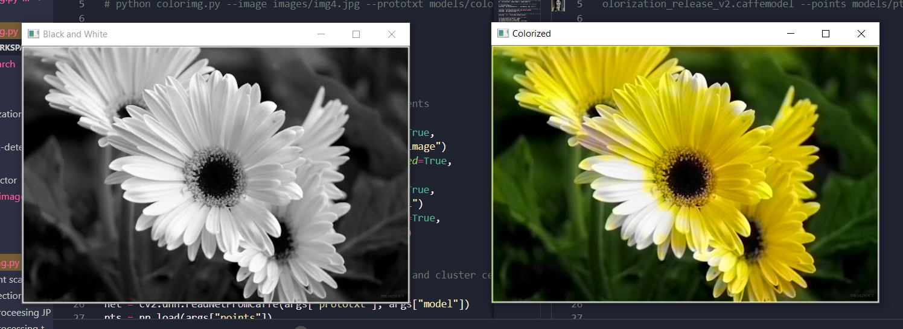

# Colorize Grayscale Images
This project helps us colourize Black and White images by using OpenCV, Deep learning and Python. Deep learning comes into play where no objects are given an absurd colour, eg: a sea cannot be hot pink.
---
## How can we colorize black and white images with deep learning?

Previous approaches to black and white image colorization relied on manual human annotation and often produced desaturated results that were not “believable” as true colorizations.
Zhang et al. decided to attack the problem of image colorization by using Convolutional Neural Networks to “hallucinate” what an input grayscale image would look like when colorized.

To train the network Zhang et al. started with the [ImageNet dataset] (http://image-net.org/) and converted all images from the RGB color space to the Lab color space.

Similar to the RGB color space, the Lab color space has three channels. But unlike the RGB color space, Lab encodes color information differently:

* The L channel encodes lightness intensity only
* The a channel encodes green-red.
* And the b channel encodes blue-yellow
A full review of the Lab color space is outside the scope of this post (see [this guide](https://en.wikipedia.org/wiki/CIELAB_color_space) for more information on Lab), but the gist here is that Lab does a better job representing how humans see color.

Since the L channel encodes only the intensity, we can use the L channel as our grayscale input to the network.

From there the network must learn to predict the a and b channels. Given the input L channel and the predicted ab channels we can then form our final output image.

The entire (simplified) process can be summarized as:

* Convert all training images from the RGB color space to the Lab color space.
* Use the L channel as the input to the network and train the network to predict the ab channels.
* Combine the input L channel with the predicted ab channels.
* Convert the Lab image back to RGB.
To produce more plausible black and white image colorizations the authors also utilize a few additional techniques including mean annealing and a specialized loss function for color rebalancing

### For more details on the image colorization algorithm and deep learning model, be sure to refer to [the official publication of Zhang et al.](http://richzhang.github.io/colorization/)

## run the code using this command:


```
  python colorimg.py --image images/img1.jpg --prototxt models/colorization_deploy_v2.prototxt --model models/colorization_release_v2.caffemodel --points models/pts_in_hull.npy
  python colorimg.py --image images/img2.jpg --prototxt models/colorization_deploy_v2.prototxt --model models/colorization_release_v2.caffemodel --points models/pts_in_hull.npy
  python colorimg.py --image images/img3.jpg --prototxt models/colorization_deploy_v2.prototxt --model models/colorization_release_v2.caffemodel --points models/pts_in_hull.npy
  python colorimg.py --image images/img4.jpg --prototxt models/colorization_deploy_v2.prototxt --model models/colorization_release_v2.caffemodel --points models/pts_in_hull.npy
```

## Screenshot 


## Details about the project

* the `images/` folder has the input images
* the `results/` folder has the colourized images 
* the Caffe model and prototxt are inside the `models/`  directory along with the cluster points NumPy file, but not uploaded here.

## Models Used

`colorization_release_v2.caffemodel` : The path to the model weights trained in Caffe.
`colorization_deploy_v2.prototxt` : Caffe specific file which defines the network.
`pts_in_hull.npy` : Path to cluster center points stored in numpy format.
